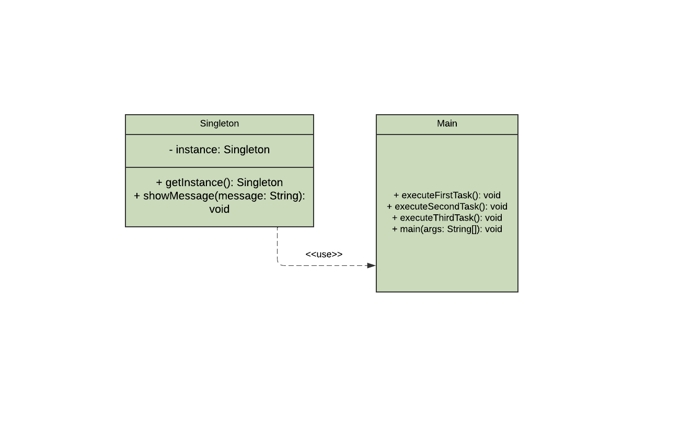

# Descrição

O padrão de projeto Singleton é um padrão de criação que garante que uma classe tenha uma única instância ao longo de toda a aplicação e fornece um ponto global de acesso a essa instância. Ele é útil para cenários onde é necessário um único objeto que centralize recursos ou controle, como em classes que gerenciam conexões de banco de dados, logs ou configurações globais.

# Qual problema é resolvido por esse padrão? Quando utilizar?

O Singleton resolve o problema de garantir que apenas uma única instância de uma classe seja criada e que todos os componentes da aplicação possam acessar essa mesma instância de maneira controlada e global. Isso é útil para evitar inconsistências e economizar recursos em situações onde múltiplas instâncias poderiam causar conflitos ou redundâncias desnecessárias. O Singleton pode ser utilizado quando a aplicação requer explicitamente que haja apenas uma única instância de um objeto, e você deseja garantir isso em todo o sistema, também quando um recurso ou funcionalidade precisa ser acessível de qualquer lugar da aplicação, mas sem a necessidade de criar múltiplas instâncias.

# Diagrama UML

# Vantagens

- Vantagens
O padrão Singleton garante que uma classe tenha apenas uma única instância durante toda a aplicação, proporcionando um ponto de acesso global e centralizado. Ele ajuda a economizar recursos ao evitar a criação de múltiplas instâncias desnecessárias, mantendo a consistência no estado compartilhado e simplificando o gerenciamento de recursos críticos, como configurações globais ou conexões de banco de dados. Além disso, sua implementação é simples e eficaz, tornando-o ideal para cenários onde é necessário controle centralizado.

# Desvantagens

- Desvantagens
O padrão Singleton pode introduzir desvantagens como alto acoplamento, dificultando a manutenção e evolução do código, além de comprometer a testabilidade ao criar dependências globais difíceis de isolar em testes unitários. Em ambientes multithreaded, sua implementação pode ser complexa, exigindo mecanismos de sincronização para evitar condições de corrida. Além disso, o uso excessivo de Singletons pode violar princípios de design, como responsabilidade única, tornando o código menos modular e mais propenso a problemas de escalabilidade.