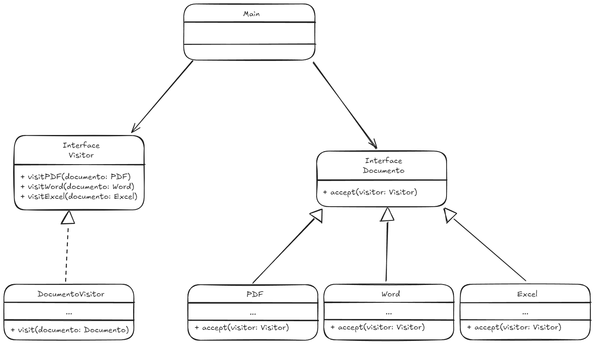

# Descrição

O padrão de projeto Visitor permite que operações sejam adicionadas a uma estrutura de objetos sem alterar suas classes.

# Qual problema é resolvido por esse padrão? Quando utilizar?

Esse padrão é útil quando é necessário generalizar um conjunto de classes relacionadas e ainda assim manter a separação entre as operações e as classes. \
Os problemas resolvidos pelo Visitor são:
 - Evitar violação do Princípio Aberto-Fechado: O Visitor adiciona novas operações em uma nova classe, fazendo com que a classe se extenda sem altera-la.
 - O código fica mais modularizado e fácil de entender.

# Diagrama UML



# Vantagens

- Facilidade de adição de operações sem modificar suas classes
- A lógica das operações é isolada em cada visitante, mantendo os elementos com seu foco principal.

# Desvantagens

- Comprometimento do encapsulamento em casos que é necessário expor dados privados.
- Quanto mais classes e visitantes mais trabalhoso será para realizar manutenção.

# Exemplo
Um exemplo de implementação está nessa pasta, a linguagem utilizada foi Typescript, então é necessário que esteja instalado em seu sistema:
- NodeJs
- Typescript (npm install -g typescript)

Para testar o funcionamento basta rodar ```npm run build``` para transpilar o código para javascript e ```npm run start``` para executar.